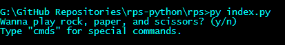

# rps-python

An advanced **Python** _rock-paper-scissors_ console application.

## How to play:
To run this game, clone the repository by typing this in the terminal: `git clone <this-repository>` and  
`cd <this-repository>`. Alternatively, you can look at the [releases page](https://github.com/clark-john/rps-python/releases) to download the source files.

After cloning the repo, please run the **index.py** file first, otherwise it won't work.  
You can also type this into terminal: `python index.py` or `py index.py`

For those who downloaded at the [releases page](https://github.com/clark-john/rps-python/releases):  
Any of these releases (latest) contain compiled Python files, so that you can run it directly on Windows or run it inside the terminal with `./index.pyc`.

Now you choose between these options below:  
  

**y/n** (yes or no) or **cmds** for special commands.

If you choose **y/n**: It will prompt you first to type the name of your AI/Computer player, you can type "***none***" or press _Enter_ to skip. And after typing the name, the game will start.

## What *Python* modules do you use?

See [here](./md/modules.md)

#### What *Python* modules are required to install?
These modules are required to install before running this game:

Also see [here](./md/modules.md)

Bonus: Install the required modules by running `pip install -r requirements.txt`.
Make sure your current working directory in your terminal is the same path as the _requirements.txt_ file.

#### rps-python Latest Version:

v1.0.7

## Documentation
Coming Soon:)
